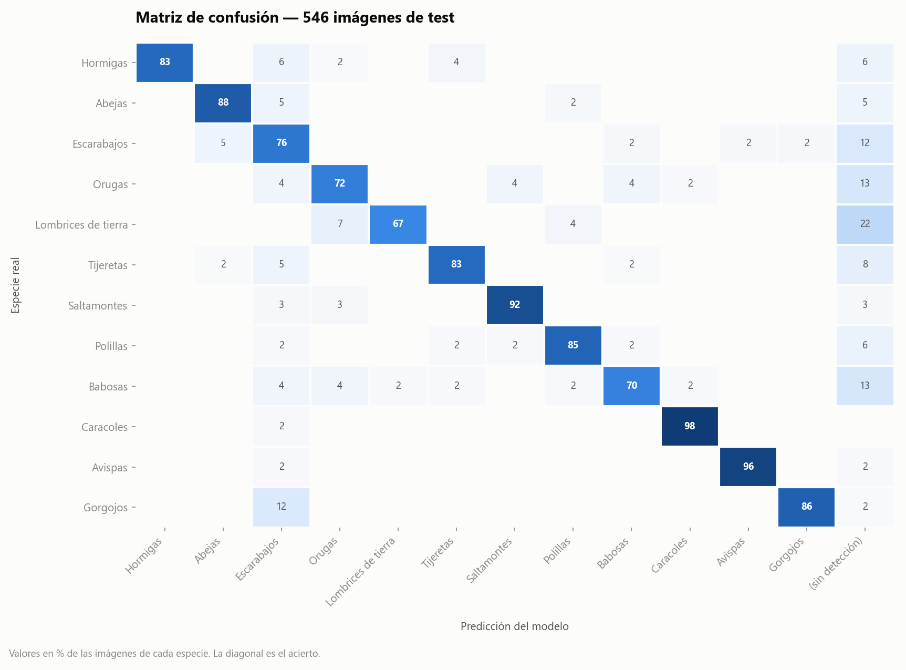
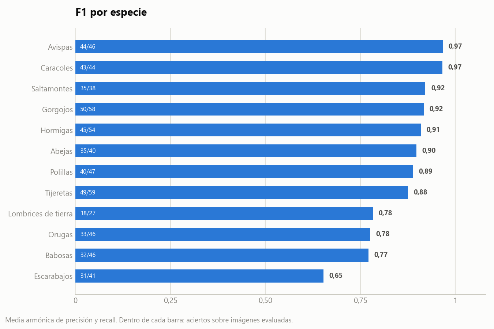
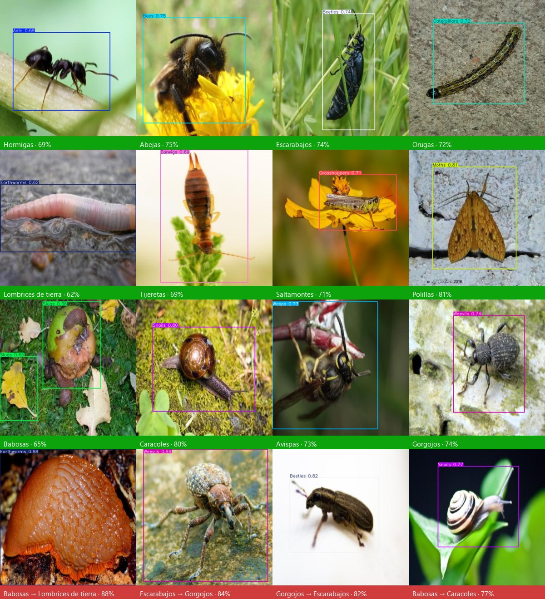

# Informe de validación

Medición del modelo `best6.pt` sobre el **conjunto de test: 546 fotografías que
el modelo nunca vio durante el entrenamiento**, cada una con su especie anotada
de antemano.

La evaluación corre sobre el mismo código que usa la aplicación (`src/detector.py`,
confianza 0,30 · IoU 0,50 · 640 px), de modo que estos números son los que
efectivamente ve el usuario final, no los de una configuración de laboratorio.

## En una frase

De cada 100 fotografías, el sistema identifica correctamente la especie en 83.
Cuando se anima a responder, acierta 9 de cada 10 veces; en el 7 % restante
prefiere no responder antes que arriesgar un diagnóstico equivocado.

## Resumen

| Métrica | Valor | Qué significa |
|---|---|---|
| Aciertos (top-1) | **455/546 · 83,3 %** | La especie más probable fue la correcta |
| F1 macro | **0,86** | Promedio del desempeño de las 12 especies, sin que las clases grandes tapen a las chicas |
| Confianza media en aciertos | 0,70 | Qué tan seguro estaba cuando acertó |
| Confianza media en errores | 0,53 | Los errores llegan con menos seguridad: el número es informativo |
| Sin ninguna detección | 39 · 7,1 % | No encontró nada que superara el umbral |
| Tiempo por imagen (CPU) | 206 ms · p95 297 ms | Sin GPU, en una máquina de escritorio |

### Métricas de detección (validación estándar de Ultralytics)

| Métrica | Valor |
|---|---|
| mAP@0,5 | 0,754 |
| mAP@0,5:0,95 | 0,432 |
| Precisión | 0,825 |
| Recall | 0,685 |

Estas métricas evalúan además **dónde** quedó la caja delimitadora, no solo si la
especie fue la correcta; por eso son más exigentes que el 83,3 % de acierto.



## Desempeño por especie

| Especie | Imágenes | Aciertos | Precisión | Recall | F1 | Sin detección |
|---|---:|---:|---:|---:|---:|---:|
| Caracoles | 44 | 43 | 0,956 | 0,977 | **0,966** | 0 |
| Avispas | 46 | 44 | 0,978 | 0,957 | **0,967** | 1 |
| Saltamontes | 38 | 35 | 0,921 | 0,921 | **0,921** | 1 |
| Gorgojos | 58 | 50 | 0,980 | 0,862 | **0,917** | 1 |
| Hormigas | 54 | 45 | 1,000 | 0,833 | **0,909** | 3 |
| Abejas | 40 | 35 | 0,921 | 0,875 | **0,897** | 2 |
| Polillas | 47 | 40 | 0,930 | 0,851 | **0,889** | 3 |
| Tijeretas | 59 | 49 | 0,925 | 0,831 | **0,875** | 5 |
| Lombrices de tierra | 27 | 18 | 0,947 | 0,667 | **0,783** | 6 |
| Orugas | 46 | 33 | 0,846 | 0,717 | **0,776** | 6 |
| Babosas | 46 | 32 | 0,865 | 0,696 | **0,771** | 6 |
| Escarabajos | 41 | 31 | 0,574 | 0,756 | **0,653** | 5 |



## Análisis de los 91 errores

### 1. No detectar nada — 39 casos (43 % de los errores)

Es la fuente de error más grande, y la más benigna: el sistema no se equivoca de
especie, se abstiene. Se concentra en las especies de silueta difusa contra el
fondo —lombrices (22 % de sus fotos), orugas (13 %), babosas (13 %)— y en
fotografías donde el individuo ocupa una porción mínima del encuadre.

**Mitigación disponible hoy:** bajar el umbral de confianza en el panel lateral,
o tomar la foto más cerca. **Mitigación de fondo:** ampliar el entrenamiento con
imágenes de estas tres especies a distintas escalas.

### 2. «Escarabajos» funciona como clase imán — 23 falsos positivos

Escarabajos es la única clase con precisión baja (0,574): recibe 23 detecciones
que en realidad eran otra especie. El desglose:

| Especie real | Predicha como escarabajo |
|---|---:|
| Gorgojos | 7 |
| Hormigas | 3 |
| Tijeretas | 3 |
| Abejas | 2 |
| Orugas | 2 |
| Babosas | 2 |
| Otras | 4 |

El caso dominante —**gorgojos clasificados como escarabajos**— es en rigor
taxonómicamente correcto: los gorgojos *son* un tipo de escarabajo
(*Curculionidae*, dentro del orden *Coleoptera*). El dataset los separa como
clases hermanas y el modelo paga esa distinción fina. Desde el punto de vista
agronómico el costo es bajo: ambas fichas apuntan a control, aunque el manejo
recomendado difiere (trampas de luz y *Beauveria* vs. control de humedad en
almacenamiento y rotación de cultivos).

### 3. Confusiones entre cuerpos blandos — 7 casos

Orugas ↔ babosas ↔ lombrices se confunden entre sí en 7 imágenes. Son cuerpos
alargados sin apéndices visibles; la textura y el brillo de la piel son la única
señal que las separa, y se pierde con poca luz o desenfoque.

### 4. Impacto agronómico de los errores

Lo que importa no es solo cuántas veces se equivoca, sino **si el error lleva a
una decisión equivocada en el campo**:

- De **67 fotografías de especies benéficas** (abejas y lombrices), 6 fueron
  reportadas como especie a controlar o vigilar. Es el error costoso —podría
  derivar en una aplicación innecesaria sobre polinizadores— y ocurre en el 9 %
  de los casos.
- En sentido inverso, **4 de 479 plagas** (0,8 %) se reportaron como especie
  benéfica, es decir, un tratamiento omitido.

## Efecto del umbral de confianza

El umbral es ajustable en vivo desde la aplicación. Simulado sobre las
predicciones cacheadas:

| Umbral | Aciertos sobre las 546 | Fotos con respuesta | Acierto entre las respondidas |
|---|---:|---:|---:|
| **0,30** (por defecto) | 83,3 % | 93 % | 89,7 % |
| 0,40 | 80,6 % | 88 % | 91,3 % |
| 0,50 | 74,5 % | 79 % | 93,8 % |
| 0,60 | 66,5 % | 69 % | 96,0 % |

La lectura práctica: **0,30 es el punto correcto para monitoreo de campo**, donde
conviene ver todo lo que hay. Para un informe técnico que se firma, subir a 0,50
eleva la confiabilidad de cada respuesta emitida a 94 % a cambio de dejar una de
cada cinco fotos sin diagnóstico.

## Casos de ejemplo



Un caso representativo de cada especie —el de confianza mediana, ni el mejor ni
el peor— y los cuatro errores de mayor confianza de toda la prueba.

## Limitaciones de esta medición

- **Una especie por fotografía.** El dataset tiene imágenes de un solo
  espécimen dominante; el desempeño sobre fotografías de campo con varios
  individuos y fondo complejo no está medido acá.
- **Sesgo de origen.** Las imágenes son de banco fotográfico, con el insecto
  centrado y enfocado. Una foto de celular con tierra, sombra y movimiento es un
  escenario más duro.
- **Sin variación estacional ni geográfica.** El conjunto no está estratificado
  por región ni por época del año.

El paso natural antes de un despliegue productivo es una segunda validación con
**fotografías tomadas en el cultivo objetivo**, con el celular que se va a usar
en la práctica.

## Reproducir

```bash
python evaluacion/evaluar.py --data ruta/al/data-set/data.yaml
python evaluacion/graficos.py --data ruta/al/data-set/data.yaml
```

Los archivos de `evaluacion/resultados/` (`predicciones.csv`,
`metricas_por_clase.csv`, `resumen.json`) contienen la salida cruda: una fila por
imagen evaluada, con la predicción, la confianza y el tiempo de inferencia.
